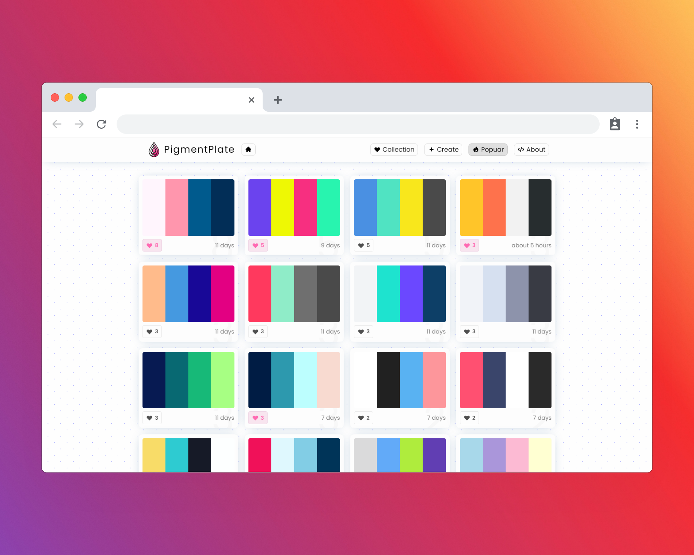
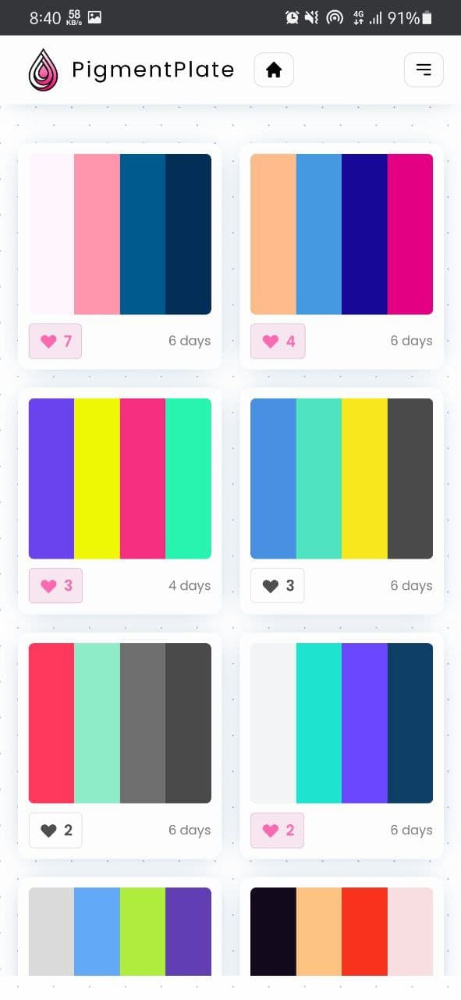
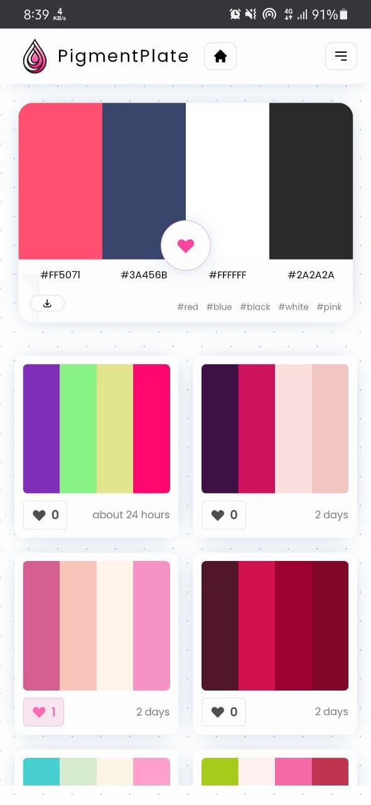
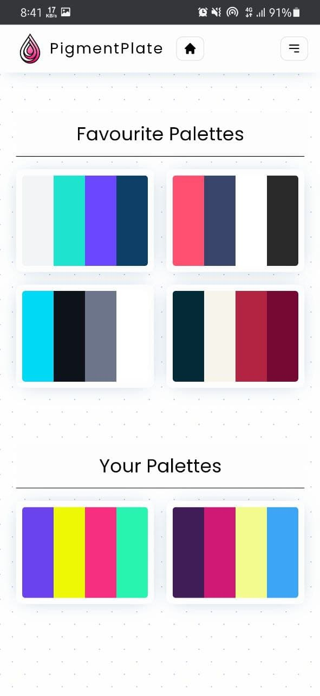
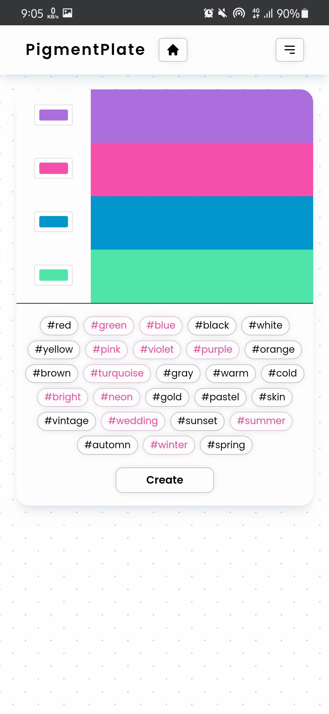
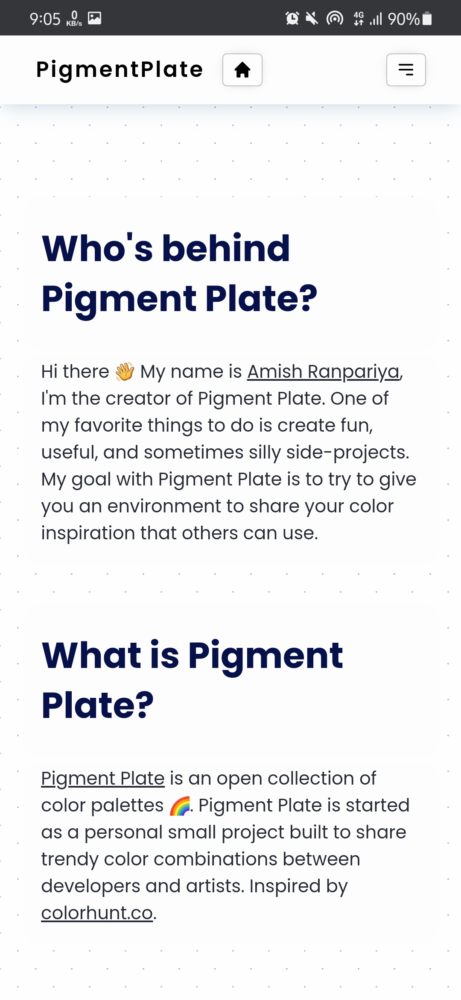
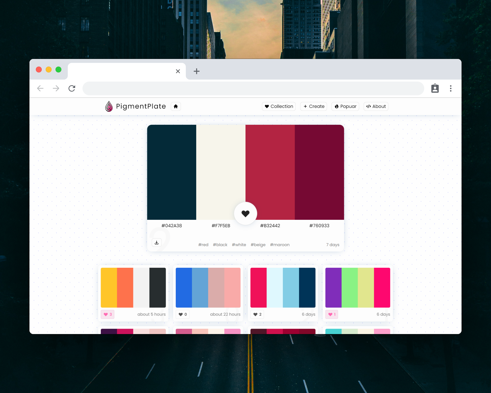
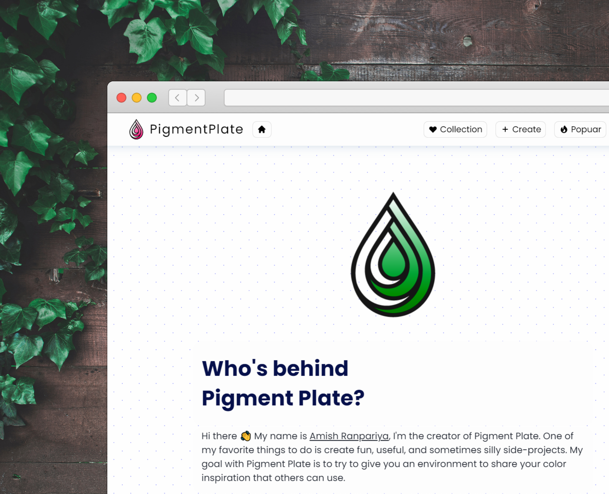
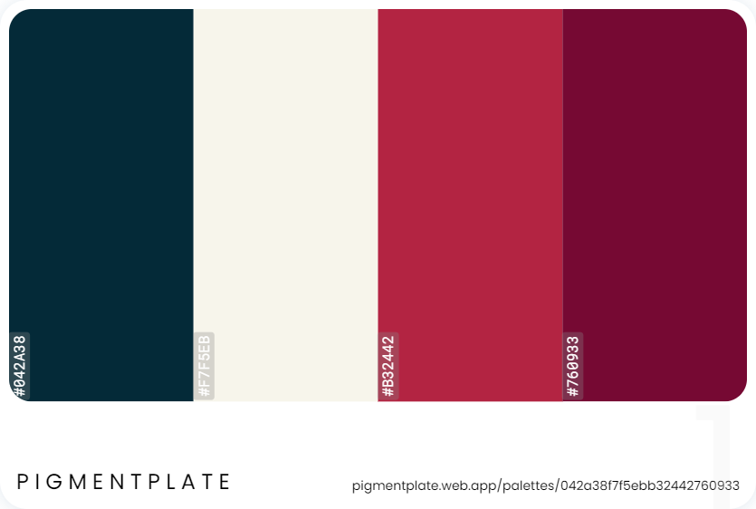
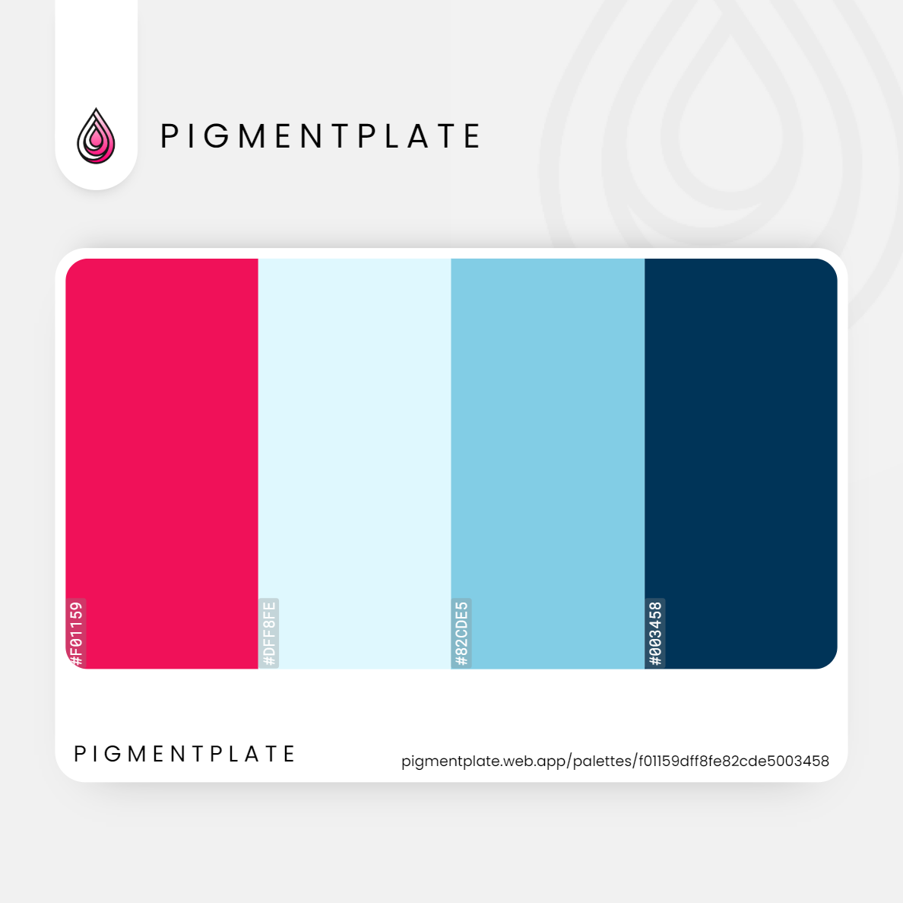

 

<a align="center" >
<h1>
Pigment Plate Web App
</h1>

Personal project, Color Inspiration App

</a>

  

## Table of contents

- [Table of contents](#table-of-contents)
- [Overview](#overview)
  - [Screenshot](#screenshot)
- [Palette Download Sample](#palette-download-sample)
- [Social Post Download Sample](#social-post-download-sample)
  - [Links](#links)
  - [Built with](#built-with)
- [Author](#author)

## Overview

🎨 Pigment Plate is a community generated, open collection of color palettes.

I tried to give people **an environment to share color schemes** that others may use. Users can surf the palettes and inspire themselves with diverse and unique, community-generated color palettes.

My goal with this project was to create a **minimal and responsive UI** with a **powerful expandable backend**. I used many technologies like **React, Redux, Firebase, PWA**; and learned so many new things and problem-solving.

If you have beautiful palette ideas, contribute to pigmentplate website - **[@pigmentplate]("https://pigmentplate.web.app/")**.

Visit **[pigmentplate]("https://pigmentplate.web.app/")** for such palettes.

### Screenshot

---

---

## Palette Download Sample

---

## Social Post Download Sample

---

### Links

- Code URL : [https://github.com/AmishRanpariya/pigmentplate](https://github.com/AmishRanpariya/pigmentplate)
- Live Site URL : [https://pigmentplate.web.app/](https://pigmentplate.web.app/)

### Built with

- Semantic HTML5 markup
- CSS Grid & Flex
- Firebase - Realtime Database & Authentication
- React - JS library
- PWA

## Author

- Website - [@pigmentplate](https://pigmentplate.web.app/)
- Github - [@amishranpariya](https://github.com/AmishRanpariya)
- LinkedIn - [@amishranpariya](https://www.linkedin.com/in/amish-ranpariya-753662156/)
